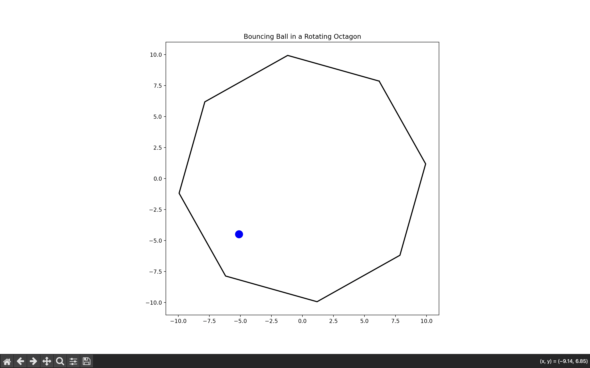

Bouncing Ball in a Rotating Octagon Simulation

This project simulates a ball bouncing inside a rotating octagon under the influence of gravity. The simulation uses Python, along with NumPy and Matplotlib, to accurately model the physics of the ball’s motion and its elastic collisions with the moving boundaries of the octagon.

Preview

	A snapshot of the bouncing ball inside the rotating octagon.
    

Features

✅ Realistic Physics:
	•	Gravity acting on the ball.
	•	Elastic collisions with the walls of the octagon.
	•	Collision handling that accounts for the wall’s motion due to rotation.

✅ Rotating Environment:
	•	The octagon rotates slowly while the ball bounces rapidly within it.

✅ Customizable Parameters:
	•	Easily adjust gravity, ball size, initial velocity, rotation speed, and more in the source code.

Repository Structure

bouncing_ball/
├── main.py          # Main simulation code
├── README.md        # This file
├── screenshot.png   # Screenshot of the simulation
└── requirements.txt # Python dependencies

Installation

1. Clone the Repository

git clone https://github.com/Abhay-2004/Bouncing-Ball-in-a-Rotating-Octagon-Simulation.git
cd Bouncing-Ball-in-a-Rotating-Octagon-Simulation

2. Set Up a Virtual Environment (Optional but Recommended)

python -m venv venv
source venv/bin/activate   # On Windows: venv\Scripts\activate

3. Install Dependencies

pip install -r requirements.txt

Usage

To run the simulation, simply execute:

python main.py

A Matplotlib window will open, displaying the animated simulation of the ball bouncing inside the rotating octagon.

Customization

You can tweak the simulation parameters in main.py to suit your needs:
	•	Physics Parameters:
	•	Adjust gravity (g), ball radius (ball_radius), initial velocity (ball_vel), and time step (dt).
	•	Octagon Parameters:
	•	Change the octagon size (octagon_radius), number of sides (num_sides), and rotation speed (omega).

Acknowledgments
	•	Developed using Python, NumPy, and Matplotlib.
	•	Inspired by real-world physics simulations and interactive animations.

